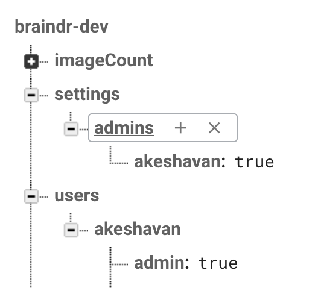

# braindr

> a firebase app for braindr: Tinder for brains

## Firebase setup

1. Create a firebase account
2. Click on "Web Setup" and copy paste your config into `src/firebaseConfig.js`
3. Go to the Authentication and click "Sign-In method" and enable Email/Password
4. Go to the Database tab and click "Rules" and copy paste the following:

```
{
  "rules": {
    ".read": "auth != null",
    ".write": "auth != null",
    "users": {
      ".read": true,
      ".write": "auth != null",
    },
    "settings": {
      ".read": true,
      ".write": false,
    }
  }
}
```

5. run the app: `npm run dev` and open `localhost:8080`. Create a new account
6. Go to the Database tab in Firebase. Create key value pairs like this:

```
settings: {
  admins: {
    your_username: true,
  },
}

users: {
  your_username: {
    admin: true
  }
}
```
7. Upload a JSON file w/ pointers to your images into a key-value pair called `imageCount`:
```
[
  imageFilename1: {
    ave_score: 0,
    num_votes: 0
  },
  ...
]
```

Your database should look like:



8. Also host your images somewhere else (like S3), it will be cheaper to pull images from there instead of firebase. The images will be found at: `https://yourS3bucket/imageFilename1.jpg`
9. Edit the `imageBaseUrl` in `src/components/Play.vue` to point to your images. The url will have the image name appended to the end with the `.jpg` extension
10. Start playing

These instructions will probably change soon. The app is still being actively developed!

## Build Setup

``` bash
# install dependencies
npm install

# serve with hot reload at localhost:8080
npm run dev

# build for production with minification
npm run build

# build for production and view the bundle analyzer report
npm run build --report

# run unit tests
npm run unit

# run e2e tests
npm run e2e

# run all tests
npm test
```

For a detailed explanation on how things work, check out the [guide](http://vuejs-templates.github.io/webpack/) and [docs for vue-loader](http://vuejs.github.io/vue-loader).
